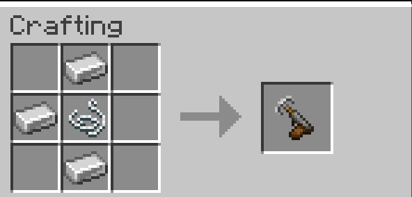

# 🪝 Grappling Hook Mod

A lightweight NeoForge mod for Minecraft 1.21.1 that adds a fully functional grappling hook to the game.

---

## ✨ Features

- **Launch** the grappling hook toward any solid block
- **Hook** onto surfaces and get pulled toward them automatically
- **Pull** yourself with a second right-click once the hook is attached
- **Chain rope** rendered between your hand and the hook
- **Lightweight** - only 1 entity spawned per player, no lag

---

## 🔧 Crafting

---

## 🎮 How to Use

1. Hold the **Grappling Hook** in your hand
2. **Right-click** to launch the hook
3. The hook flies and attaches to the first solid block it hits
4. You are automatically pulled toward it
5. **Right-click again** to propel yourself and release the hook
6. If the hook is still in flight, right-clicking cancels it

---

## 📦 Installation

1. Install [NeoForge 1.21.1](https://neoforged.net/)
2. Drop the `.jar` file into your `mods/` folder
3. Launch the game

---

## 🛠️ Compatibility

| Minecraft | NeoForge |
|-----------|----------|
| 1.21.1    | 21.1.x   |

---

## 📜 License

© Jessy DAVID - All Rights Reserved. You may not redistribute, modify or use this mod without explicit permission from the author.